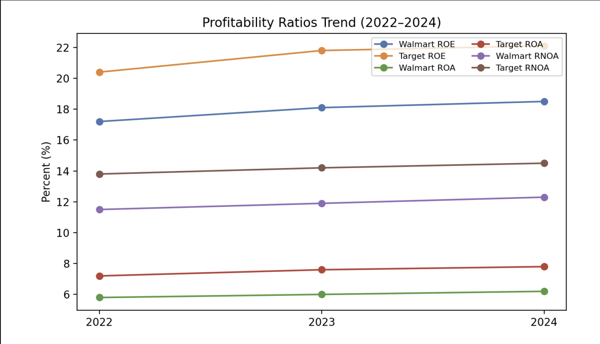
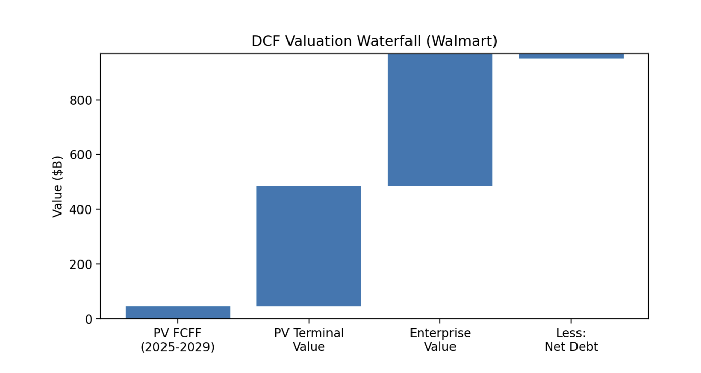

# Walmart vs. Target — Financial Analysis & Stock Recommendation

## Project Overview

This project presents a comparative financial and investment analysis of Walmart Inc. (NYSE: WMT) and Target Corporation (NYSE: TGT) using financial data from 2022–2024.

The analysis evaluates profitability, operating efficiency, liquidity, solvency, financial leverage, and overall financial performance using ratio analysis, DuPont decomposition, and RNOA decomposition.

The project also incorporates Discounted Cash Flow (DCF) valuation and sensitivity analysis to estimate intrinsic value and develop investment conclusions for both companies.

---

## Objectives

- Compare Walmart and Target's financial performance
- Evaluate profitability, operating efficiency, liquidity, and solvency
- Analyze financial leverage and debt coverage
- Examine ROE drivers using DuPont decomposition
- Evaluate operating performance using RNOA decomposition
- Estimate intrinsic value using DCF valuation
- Test valuation assumptions through sensitivity analysis
- Develop investment conclusions based on financial and valuation analysis

---

## Key Findings

### Profitability

Target demonstrated stronger profitability metrics during the analyzed period, while both companies showed improving profitability trends.

**FY2024:**

| Metric | Walmart | Target |
|--------|---------|--------|
| ROE | 18.5% | 22.1% |
| ROA | 6.2% | 7.8% |
| RNOA | 12.3% | 14.5% |

### Operating Efficiency

Walmart demonstrated stronger operating efficiency across several major turnover metrics.

**FY2024:**

| Metric | Walmart | Target |
|--------|---------|--------|
| Accounts Receivable Turnover | 65.2x | 42.1x |
| Inventory Turnover | 11.5x | 6.2x |
| Accounts Payable Turnover | 8.4x | 7.1x |
| PPE Turnover | 3.8x | 4.1x |

Walmart outperformed Target in accounts receivable, inventory, and accounts payable turnover, while Target recorded slightly higher PPE turnover.

### Financial Stability

Walmart maintained stronger debt coverage and a more conservative capital structure.

**FY2024:**

| Metric | Walmart | Target |
|--------|---------|--------|
| Times Interest Earned | 12.5x | 8.2x |
| Operating Cash Flow / Debt | 0.32 | 0.28 |
| Free Cash Flow / Debt | 0.18 | 0.14 |
| Debt / Equity | 0.82x | 1.15x |

Target's stronger profitability is accompanied by greater financial leverage, while Walmart maintains a more conservative financial structure.

---

## Financial Performance Snapshot

The following analysis highlights key profitability and financial performance trends for Walmart and Target.

---

## DuPont & RNOA Analysis

### DuPont Analysis

DuPont decomposition was used to examine the underlying drivers of Return on Equity:

**ROE = Net Profit Margin × Asset Turnover × Equity Multiplier**

The analysis illustrates how profitability, operating efficiency, and financial leverage contribute to shareholder returns.

### RNOA Decomposition

Return on Net Operating Assets was analyzed using:

**RNOA = Net Operating Profit Margin × Net Operating Asset Turnover**

This provides additional insight into the operating performance of Walmart and Target independent of financing decisions.

---

## DCF Valuation

A Discounted Cash Flow framework was used to estimate intrinsic value based on Free Cash Flow to the Firm (FCFF).

The valuation incorporates:

- NOPAT
- Depreciation
- Capital Expenditures
- Changes in Working Capital
- Weighted Average Cost of Capital (WACC)
- Terminal Value

### Walmart

**Estimated intrinsic value:** ~$173 per share  
**Reference market price:** ~$175 per share  
**Investment Conclusion:** **HOLD**

### Target

**Estimated fair value range:** $148–$152 per share  
**Reference market price:** ~$155 per share  
**Investment Conclusion:** **HOLD**

---

## Walmart DCF Sensitivity Analysis

Walmart's valuation was tested across alternative WACC and terminal-growth assumptions.

| WACC / Growth | 2.0% | 2.5% | 3.0% |
|---------------|------|------|------|
| 5.0% | $182 | $190 | $198 |
| 5.5% | $168 | $175 | $182 |
| 6.0% | $156 | $162 | $168 |

The sensitivity analysis demonstrates how changes in discount rates and long-term growth assumptions can materially affect estimated intrinsic value.

---

## Valuation Snapshot

The valuation analysis summarizes the DCF framework, sensitivity scenarios, and resulting investment conclusions.

---

## Investment Conclusion

| Company | Ticker | Valuation Conclusion |
|---------|--------|----------------------|
| Walmart Inc. | WMT | **HOLD** |
| Target Corporation | TGT | **HOLD** |

Walmart demonstrated stronger operating efficiency, debt coverage, and a more conservative capital structure, supporting a stronger defensive financial profile.

Target demonstrated stronger profitability but also carried greater financial leverage and associated financial risk.

Based on the valuation assumptions used in the project, both companies were trading relatively close to their estimated intrinsic values.

---

## Analysis Included

- Financial Statement Analysis
- Profitability Ratio Analysis
- Operating Efficiency Analysis
- Coverage Ratio Analysis
- Liquidity & Solvency Analysis
- DuPont Decomposition
- RNOA Decomposition
- Comparative Financial Analysis
- DCF Valuation
- Intrinsic Value Estimation
- Sensitivity Analysis
- Stock Recommendation

---

## Tools & Techniques

### Tool

- Microsoft Excel

### Financial Analysis

- Financial Statement Analysis
- Ratio Analysis
- Trend Analysis
- Operating Efficiency Analysis
- Liquidity & Solvency Analysis
- DuPont Analysis
- RNOA Analysis
- Comparative Analysis

### Valuation

- Discounted Cash Flow (DCF)
- Free Cash Flow to the Firm (FCFF)
- Weighted Average Cost of Capital (WACC)
- Terminal Value
- Intrinsic Value Analysis
- Sensitivity Analysis

---

## Data Sources

Primary and supporting sources used in the analysis include:

- Walmart Form 10-K
- Target Form 10-K
- SEC EDGAR
- Walmart and Target DEF 14A Proxy Statements
- Federal Reserve Economic Data (FRED)
- Bloomberg Terminal

Detailed references are provided in the project report.

---

## Project File

**`Walmart vs Target FSA Report.pdf`**

The report contains the complete comparative financial analysis, ratio calculations, DuPont and RNOA decomposition, DCF valuation, sensitivity analysis, and investment conclusions.

---

## About the Author

**Rushitha Anantha Sambhavi Galidevara**

M.S. Finance — Investment & Quantitative Analysis  
University of Massachusetts Boston

Areas of interest include investment research, financial analysis, equity valuation, portfolio analysis, and data-driven investment decision-making.

---

## Disclaimer

This project was developed independently for educational and portfolio purposes. The analysis is based on publicly available financial information and should not be interpreted as investment advice.
